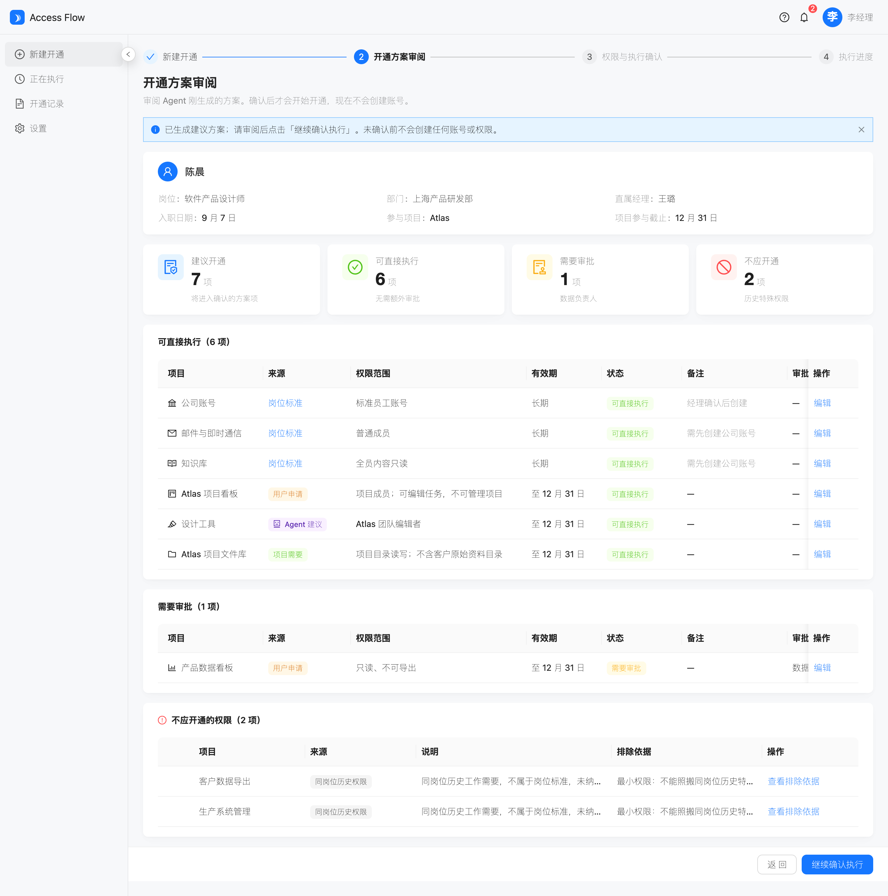
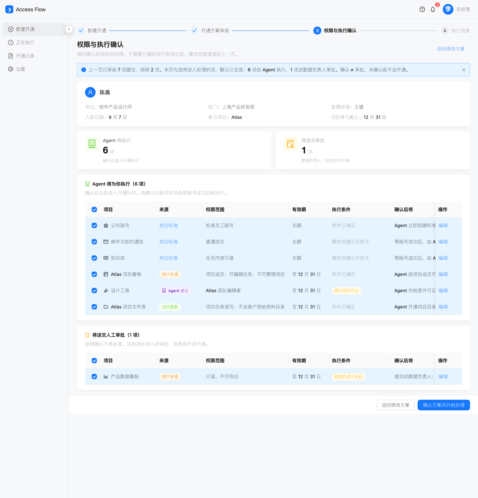
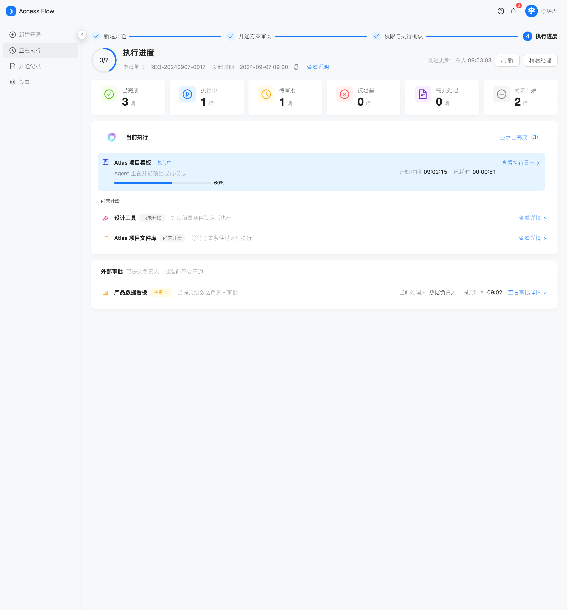
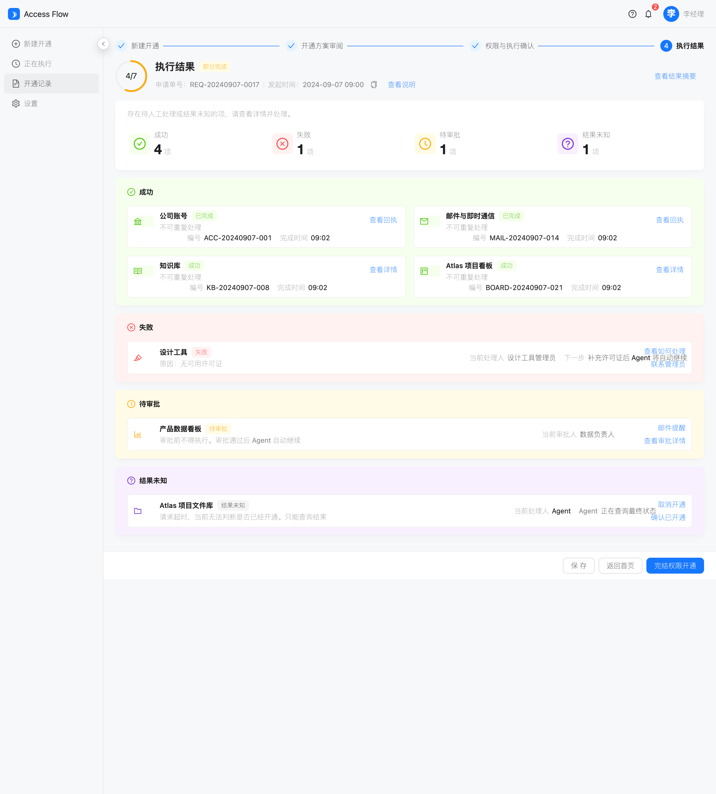

# AccessFlow

用人经理用一句话提交入职开通需求，Agent 核对后给出方案，确认后再执行。本仓库是可点击的静态工作台原型：数据写死陈晨案例，不接后端。

> 演示账号：用人经理 **王璐** · 新员工 **陈晨**（软件产品设计师 / 上海产品研发部 / Atlas）

**在线浏览：** [打开预览页](https://skylar-shao-bot.github.io/new-employee-agent/) · [直接进入工作台](https://skylar-shao-bot.github.io/new-employee-agent/app/#/?demo=chenchen)

## 本地预览

```bash
cd AccessFlow/02-wireframe
npm install
npm run dev
```

浏览器打开 http://localhost:5173

| 入口 | 地址 |
|---|---|
| 预填陈晨需求 | http://localhost:5173/?demo=chenchen |
| 开通方案审阅 | http://localhost:5173/plan |
| 权限与执行确认 | http://localhost:5173/confirm |
| 执行进度 | http://localhost:5173/progress |
| 执行结果（F01） | http://localhost:5173/f01 |

主路径：输入需求 → 审阅方案 → 确认执行 → 看进度 → 看部分完成结果。

## 界面预览

| 开通方案审阅 | 权限与执行确认 |
|---|---|
|  |  |
| **执行进度** | **执行结果** |
|  |  |

## 页面

| 页面 | 作用 |
|---|---|
| P-01 新建开通 | 自然语言提交需求，Agent 核对后生成方案 |
| P-02 开通方案审阅 | 30 秒内分清建议项与排除项 |
| P-03 权限与执行确认 | 按执行主体分组确认；确认 ≠ 审批 ≠ 开通 |
| P-04 执行进度 | 跨系统进度，未完成可稍后处理 |
| P-05 执行结果 | 固定 F01：4 成功 / 1 失败 / 1 待审批 / 1 未知 |

## 目录

```text
AccessFlow/
  00-source/          原始 PRD、信息架构、流程图
  00-backlog/         本期范围与 Later 项
  01-prd/             当前需求基线（v1.1）
  02-wireframe/       静态前端（Vite + React + Ant Design）
  04-specs/           各页布局与组件规格
  05-presentations/   方案与体验结构演示
  specs/              实现切片与项目硬规则
```

| 你要做什么 | 去哪里 |
|---|---|
| 看当前需求 | [`AccessFlow/01-prd/PRD-AccessFlow-v1.1.md`](AccessFlow/01-prd/PRD-AccessFlow-v1.1.md) |
| 看本期做什么 | [`AccessFlow/00-backlog/project-backlog.md`](AccessFlow/00-backlog/project-backlog.md) |
| 看单页规格 | [`AccessFlow/04-specs/`](AccessFlow/04-specs/) |
| 看实现切片 | [`AccessFlow/specs/001-static-main-path/spec.md`](AccessFlow/specs/001-static-main-path/spec.md) |

## 技术栈

- React 19 + TypeScript + Vite 7
- Ant Design 6
- React Router 7

本期不做登录、真实企业系统接入和模型调用。

## 设计约束

- 确认 ≠ 审批 ≠ 开通，四个事实分开表达
- 高风险权限（客户数据导出、生产系统管理）必须排除并解释
- 未知结果只查询、不重试；已成功项禁止重复执行
- 部分完成不得显示成全部完成
